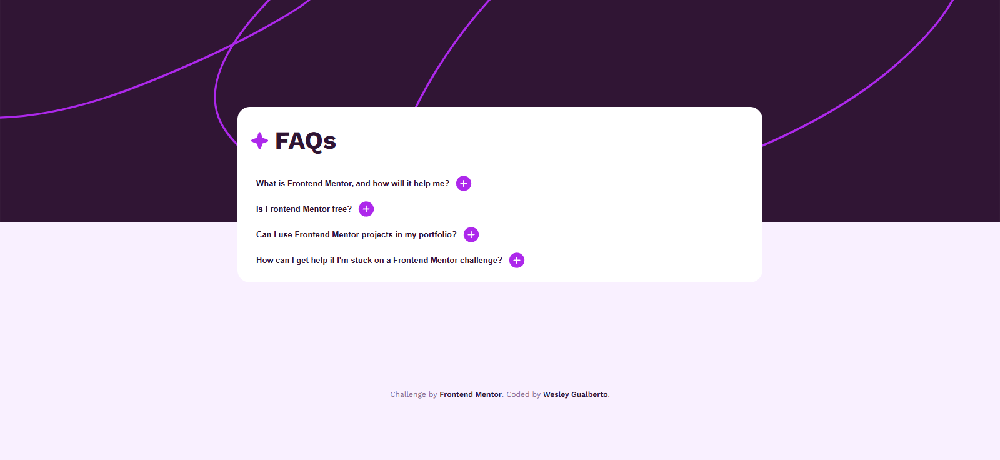
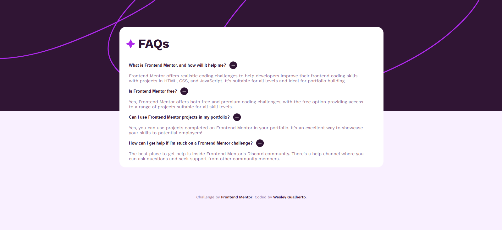
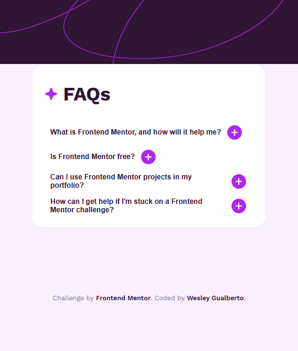
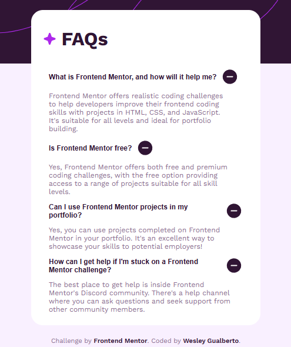

# 📄 FAQ Accordion

Projeto de um componente interativo de **FAQ (Perguntas Frequentes)** em formato de **acordeão**, desenvolvido com **HTML, CSS e JavaScript**, com layout responsivo e animações suaves.

🔗 **[Acesse o projeto online no GitHub Pages](https://wesleygualberto.github.io/FAQ-accordion/)**  

---

## 🎯 Funcionalidades

- ✅ Acordeão funcional para exibir ou esconder respostas  
- ✅ Ícones interativos que mudam ao abrir/fechar  
- ✅ Design responsivo para desktop, tablet e mobile  
- ✅ Estilo moderno com layout centralizado  

---

## 📸 Captura de Tela

**Desktop 🖥️**  
  
  

**Mobile 📱**  
  
  

---

## ⚙️ Tecnologias utilizadas

- HTML5  
- CSS3  
- JavaScript (ES6)  
- Media Queries  

---

## 📁 Estrutura de pastas

faq-accordion/
├── index.html
├── css/
│ ├── style.css
│ ├── tablets.css
│ └── mobile.css
├── js/
│ └── script.js
├── assets/
│ └── images/
├── project-images/
│ └── Imagem-1.png (e outras imagens)
├── README.md
└── LICENSE

---

## 📝 Licença

Este projeto está sob a Licença MIT. Veja o arquivo [LICENSE](./LICENSE) para mais detalhes.

---

## 🙌 Desafio original

Este projeto foi desenvolvido com base no desafio do site **Frontend Mentor**:

💡 [FAQ Accordion Challenge](https://www.frontendmentor.io/challenges/faq-accordion-card-XlyjD0Oam)

---

## 🙋‍♂️ Autor

Desenvolvido por **Wesley Gualberto** ✨  
Entre em contato para feedback ou sugestões!
